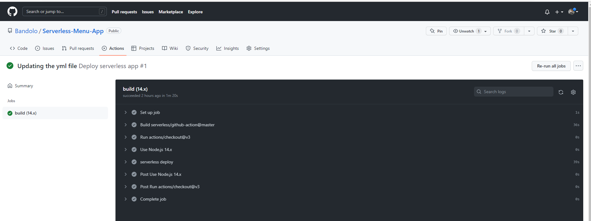

# CRUD Rest API for a Home Food Delivery Service

This app is built in the context of a restaurant, for example, that wants to improve the customer satisfaction in their home delivery services. So they are using the **CRUD** (Create, Read, Update and Delete) methods to provide customers with much flexibility around the menu customers want to order. The customer is able to **"Create"** their order by providing their name, adress and the type of food they want the restaurant to deliver to them. They can **"Update"** the dish they want incase they change their minds within the day.They can **"Delete"** the order completely, say within a defined time period.And if they want to, thay can also **"Read"** what they have ordered within the day, or Scan through the whole database of food orders, to see what others are ordering.

As seen in the diagram below, the API Gateway receives all these 05 types of requests from the customers, and based on each request,it does the role of channeing them to the dedicated lambda function,for the type of request. So the lamda functions are each doing one of the folowing:

- Reading a single item (fetchMenu Lambda Function)
- Reading all items (fetchMenus Lambda Function)
- Creating a new item (addMenu Lambda Function)
- Updating an existing order (updateMenu Lambda Function)
- Deleting an existing order (deleteMenu Lambda Function)

The code for all these lambda functions can be found in the ["handlers"](https://github.com/Bandolo/Serverless-Menu-App/tree/master/src/handlers) folderr.Taking a look at the code will guide you on what to expect like payload to submit, when testing these endpoints.


Below is the picture of the local testing of the endpoints using Postman. All the methods are working perfectly well.And each method requires a slightly different payload to provide the expected output.


Below is the screenshot from GitHub Actions on the CI/CD Pipeline. The app is deployed upon a push to the Master branch.The developer branch does not have this option deploying the app.The developer branch is used for testing.
So after going through the integration tests successfully, in the maaster branch, Github Actions will deploy the app to your AWS account.This means, if the tests fails, it will not be deployed.
w


## Pre-requisites to run the code successfully

- AWS Credentials Configuration
- Nodejs installation
- A basic knowledge of Node.JS
- A basic notion of Rest APIs

## How to use the code

- Downloading and storing in your local folder:

  While on GitHub, go to the main page of the project's repository and above the list of the 08 files in this project, click on the green **Code** button.Copy the url that appears (the default is HTTPS). Next, open Git Bash, ensure you change your current working directory to the destination folder you intend to clone the code into. Then type the following command and then press **Enter**

```log
$ git clone https://github.com/Bandolo/Serverless-Menu-App.git
```

- Installing the packages and deploying the app:
  Next, cd into the folder titled "Menu" and while there you should run run the command to install the Serverless Framework.

```log
 $ cd Menu
 $ npm install -g serverless
```

You can now go ahead and deploy the Serverless app with the following command

```log
 $ serverless deploy
```

As seen in the infrastructure diagram above, the app will create an API Gateway, 05 lambda functions and a dynamodb table, which will be deployed in the "us-east-2 region" in your AWS account.

## Testing the endpoints locally

The Serverless Framework will provide you with 05 request links. And you could test them using Postman with payloads depending on the lambda function in question.Again a basic knowedge about NodeJs and Rest API's, along with reviewing each of the relevant lamda codes, will help you test each of the endpoints successfully.

1. GET (Getting a single element using the id)
2. GET (Scanning the database to get all items)
3. POST (For adding single elements to the dynanamdb table)
4. UPDATE ( For modifying an existing meal order based on the item 'id')
5. DELETE (For deleteting an existing order based on the item 'id')
